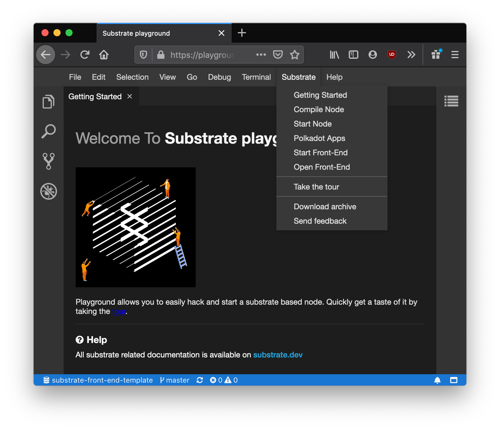

# Welcome to the Substrate Playground

In this chapter we will quickly go over the Substrate Playground, and introduce you to what is available as you start developing with Substrate.

We will:

* Introduce you to the Substrate Playground
* Tell you about starting a session in the playground
* Show you how to start a pre-compiled node
* Explain how to interact with that node using the Polkadot JS Apps

<!-- slide:break -->

