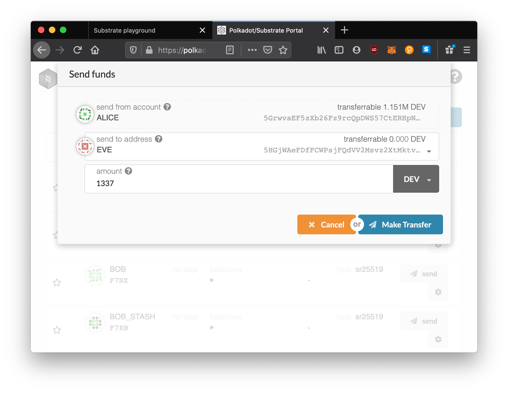

# Interact with Your Node

Let's actually play with the running node.

Because we set the `--ws-external` flag, we can actually hook up the already existing [Polkadot JS Apps](https://github.com/polkadot-js/apps) to our node and interact with it!

In the `Substrate` menu item, select `Polkadot Apps`. This should open a new tab which is configured to connect to your node's RPC endpoint.

You should see in the UI, that it detects your blockchain, and reports information about your chain like the current block number.

You can even transfer balances using an already configured cryptocurrency system in your Substrate node.

Look around and try stuff out!

<!-- slide:break -->

