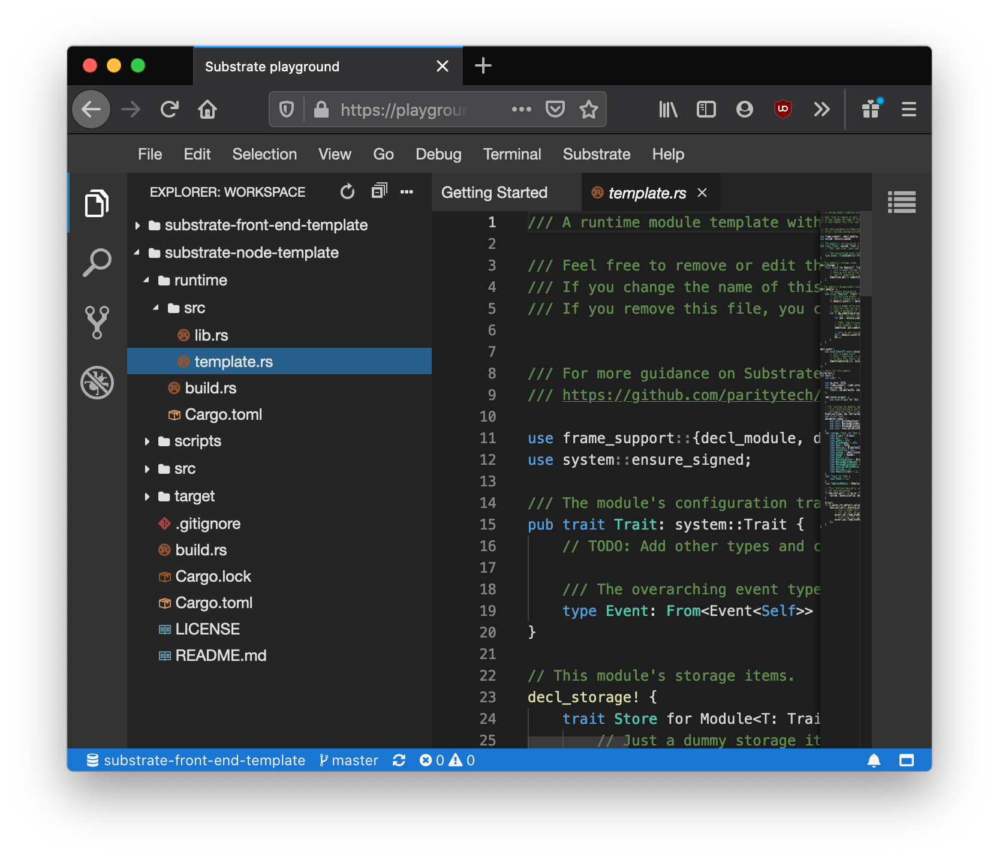

# About the Playground

The Substrate playground uses [`theia`](https://theia-ide.org/) which looks and acts like the Visual Studio Code editor from within your browser.

In the background, there is a virtual machine powering your development environment.

This VM has already been set up with all the needed pre-requisites and pre-compiled Substrate projects!

Ideally, this will make it as easy as possible for you to get started using Substrate.
But the playground is not meant to be a permanent solution for Substrate development, just a great experience to get you started. When you are ready, follow the instructions here to set up your local computer for Substrate development too:

https://substrate.dev/docs/en/overview/getting-started

<!-- slide:break -->

