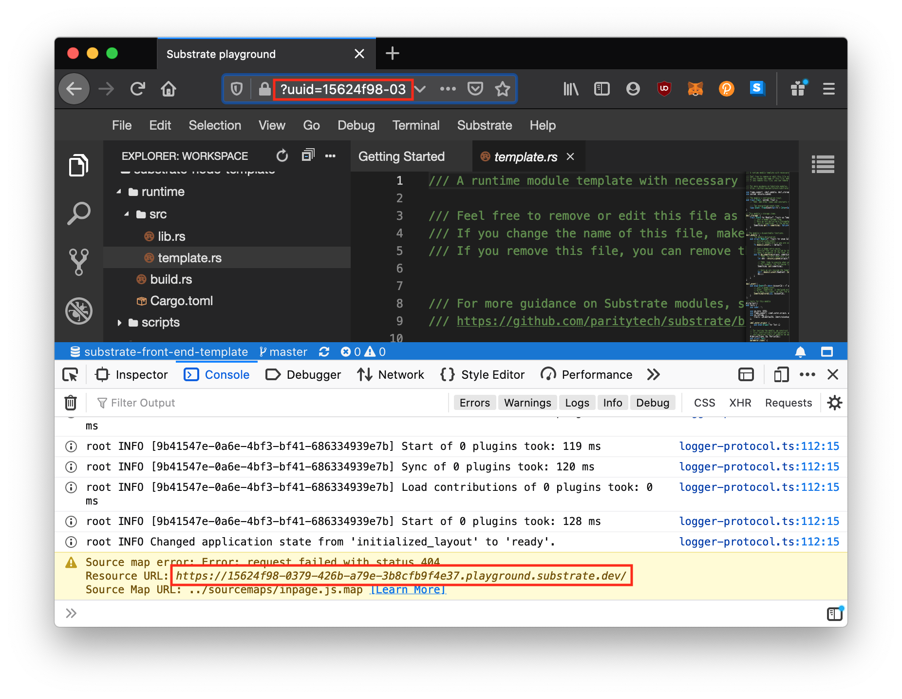

# Substrate Playground Sessions

When you start a new session in the Substrate playground, it will generate a GUID for you which is tied to your unique session.

If you need to reload the Substrate Playground or switch browsers or anything, make sure to use the same GUID so that you are placed back into the same session.

> If you are using the embedded tutorial version of the Substrate Playground, you can look at your browser console (`F12`) to find this GUID:
>
> ```js
> // Like this
> https://playground.substrate.dev/?uuid=15624f98-0379-426b-a79e-3b8cfb9f4e37
> // or
> https://a63eef02-8c1e-4498-8445-3f577e6034ba.playground.substrate.dev/
> --------^^^^^^^^^^^^^^^^^^^^^^^^^^^^^^^^^^^^--------------------------
> ```

**Sessions only last for 3 hours**, so again... the playground not meant to be a permanent development environment.

<!-- slide:break -->


