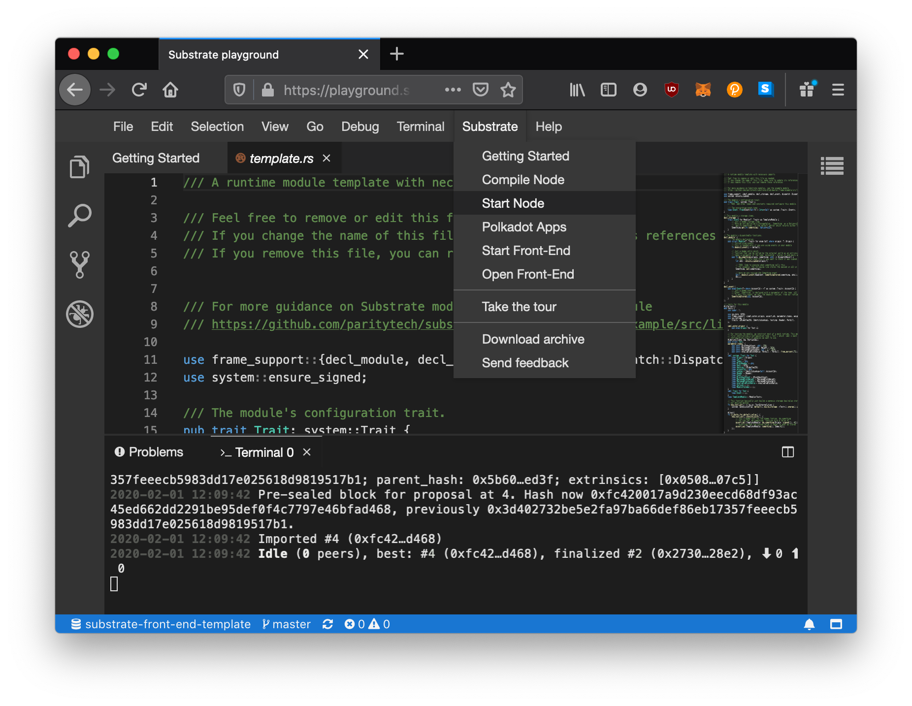

# Start a Substrate Developer Node

If you look at the menu bar of the Substrate Playground, you will notice a `Substrate` tab.
This contains a list of useful commands for interacting with your projects.

Since your Substrate node is pre-compiled, lets we can directly press `Start Node`.

This runs the following command in your embedded terminal:

```bash
./target/release/node-template --dev --ws-external
# ^^^^^^^^^^^^^^ ^^^^^^^^^^^^^ ^^^^^ ^^^^^^^^^^^^^
# path to binary  node binary  dev mode  opens your
#                                        websockets
#                                        to the public
```

If your node starts running successfully, you should see blocks being produced in your terminal.

This is a **developer** node, which means it is pre-configured with accounts with funds that you have access to for easy testing. It also includes a `sudo` user which has low level access to your blockchain. We will talk about that more later.

> **NOTE:** You can stop your node at any time with `ctrl + c`.

<!-- slide:break -->


